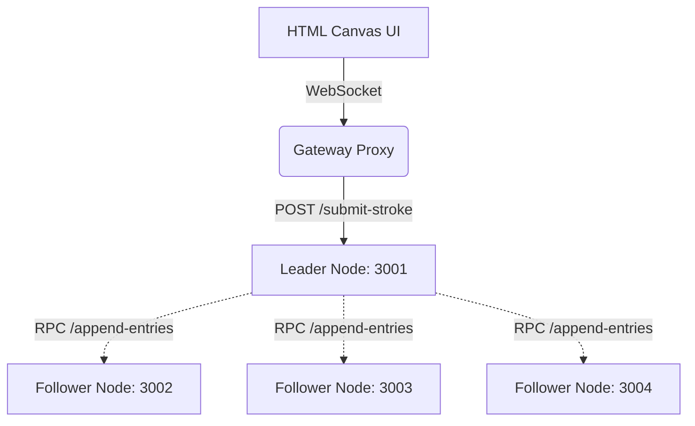

# Mini-RAFT Distributed Drawing Board

A powerful distributed systems project simulating cloud-native consensus models using a miniature version of the RAFT protocol. Multiple backend replicas maintain an identical event log of drawing strokes without relying on a central database, ensuring zero downtime even when containers crash.

## RAFT Theory Overview
*   **Leader Election**: All nodes start as Followers. If they haven't heard from a Leader before a randomized timer expires, they become a Candidate and request votes. The first to achieve a majority becomes the Leader.
*   **Log Replication**: The Leader is the only node trusted to accept client data. It appends the data (drawing strokes) to an immutable log and blasts it to Followers. Once a majority acknowledge, the state is committed.
*   **Fault Tolerance**: If a node fails, it restarts and attempts to re-sync. If the Leader fails, followers notice the lack of heartbeats and securely elect a new one without disrupting data persistence. 

## Architecture Overview



## Setup & Instructions

### Backend Start
1. Ensure Docker Desktop is running.
2. At the root of the project, run:
```bash
docker-compose up --build
```
This boots the Gateway (Port 3000) and your Replica Nodes (3001+).

### Frontend Start
1. In a separate terminal, navigate into the `frontend` folder:
```bash
cd frontend
npm install
npm run serve
```
2. Open `http://localhost:8080` in multiple browser tabs to simulate clients. 

## Assumptions & Constraints
* All system instances run over `http` inside local Docker bridges. Network latencies are artificially mimicked. 
* Logs are held in memory on the replicas and are not persisted entirely to physical disk arrays between total cluster teardowns (`docker-compose down`). 

---

## MiniRAFT Project Checklist

- [x] Leader election
- [x] WebSocket Gateway
- [x] Basic log replication
- [x] Drawing canvas integration
- [x] Graceful reload
- [x] Blue-green replica replacement
- [x] Failover correctness
- [x] Multi-client real-time sync
- [x] Demo under chaotic conditions

**Bonus Options:**
- [x] Network partitions (simulate split brain)
- [x] Add 4th replica
- [x] Add vector-based undo/redo using log compensation
- [x] Implement a dashboard showing leader, term, log sizes
- [x] Deploy to a real cloud VM (e.g., Amazon Web Services (AWS) EC2 or Google Cloud)
