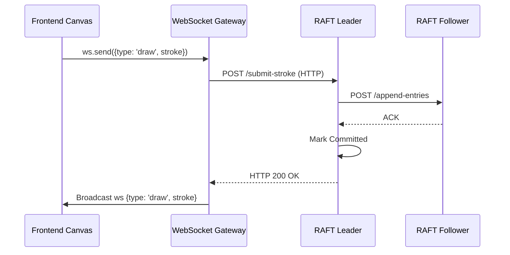

# Frontend-Backend RAFT Integration

## Core Architecture
The frontend operates completely isolated from the complexities of the Mini-RAFT protocol. It maintains a UI state and communicates with a single endpoint (the Gateway). The Gateway abstracts the consensus mechanisms, taking responsibility for leader discovery, failure retries, and request routing. 

## Used API Endpoints
*   **WebSocket**: `ws://localhost:3000/ws` (Bidirectional sync)
*   **Leader Data Submission (Gateway -> Leader)**: `/submit-stroke`, `/undo`, `/redo`, `/client_request` 
*   **Diagnostics**: `/cluster-status`, `/health`

## Data Flow (Mermaid Sequence)

## Mapping to Code 
*   **Requests Are Made**:
    *   *Frontend WS Wrapper*: `frontend/websocket/ws.js` (Line 56) `send(data)` handling socket queues.
    *   *Frontend HTTP Fallback*: `frontend/websocket/ws.js` (Line 124) `fetch('${this.baseUrl}/send')`
*   **Responses Are Handled**:
    *   *Gateway Redirection*: `gateway/index.js` (Line 143) `forwardToLeader(data)` catches network faults with retry loops.
    *   *Replica Receiving*: `replica/consensus/server.py` (Line 124) `submit_stroke(req)` handles leader execution logic.
*   **State Updates Occur**:
    *   *Frontend Broadcaster*: `frontend/websocket/ws.js` (Line 208) `socket.onMessage` parses valid states from Gateway broadcasts.
    *   *Gateway Connection*: `gateway/index.js` (Line 32) `wss.on('connection')` initializes clients.

## Mapping to RAFT Concepts
1.  **Client Ignorance**: The Client relies on the Gateway proxy. It does not possess a consensus algorithm or term clock.
2.  **Leader Redirection**: Only the **Leader** can mutate logs. If the Gateway forwards traffic to a Follower, the Follower drops it or instructs the Gateway to redirect.
3.  **Majority Confirmation**: The Gateway blocks until the Leader successfully completes the `append_entries` RPC with **Followers** and acknowledges success. At that point, the Gateway considers the stroke locked in reality and tells the frontend to retain it.
