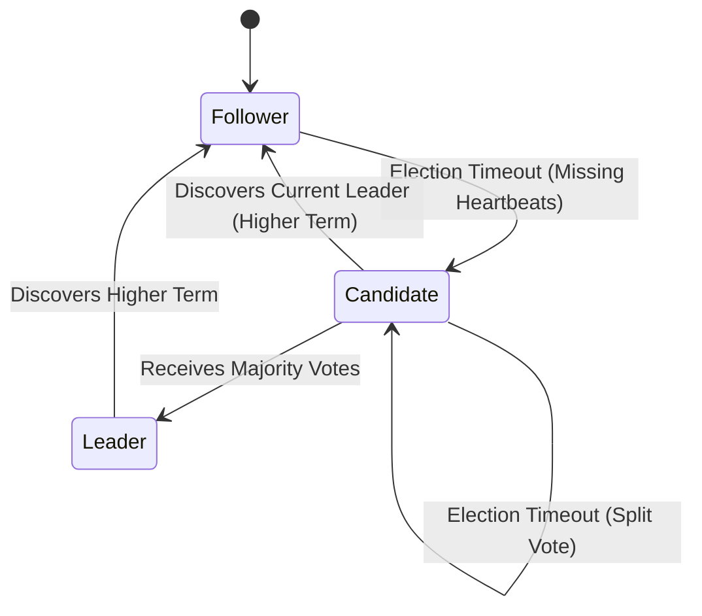

# Teammate 1 - Consensus + Partition Handling (Control Plane)

## Responsibilities
*   **Cluster Correctness**: Guaranteeing system coherence through the implementation of RAFT states (Follower, Candidate, Leader).
*   **Leader Election**: Managing election timeouts, quorum verification, and retry logic.
*   **Heartbeats**: Broadcasting periodic keep-alives to prevent unnecessary elections.
*   **Term Management**: Maintaining logical clocks for system operations.
*   **Failover & Split-Brain Security**: Safely resolving leader death and network partitions via dynamic quorum logic.

## Relevant RAFT Theory
Teammate 1's work implements the **Control Plane** of RAFT. This involves moving through defined node states, implementing term-based coordination, and upholding the principle of heartbeats to assert leadership. The theory focuses on distributed coordination and split-brain resolution, ensuring that under a network partition, only one valid leader (or none) processes requests based on majority quorum.

## Architecture Diagram

## Folders & Files
*   `replica/consensus/`
    *   `node.py`
    *   `state.py`
    *   `timer.py`
    *   `server.py`
*   `shared/`
    *   `logger.py`
*   `tests/chaos/`
    *   `test_network_partition.py`

## Specific Code References
*   **RAFT States**: `replica/consensus/state.py` (Line 4)
*   **Node Initialization & State Maintenance**: `replica/consensus/node.py` (Line 12)
*   **Start Election**: `replica/consensus/node.py` (Line 56) `start_election()`
*   **Request Vote Handler**: `replica/consensus/node.py` (Line 161) `handle_request_vote()`
*   **Heartbeat Loop**: `replica/consensus/node.py` (Line 119) `run_heartbeat_loop()`
*   **Term Management in Heartbeats**: `replica/consensus/node.py` (Line 200) `handle_heartbeat()`
*   **Server Endpoints**: `replica/consensus/server.py` (Line 73 `request_vote`, Line 78 `heartbeat`)

## Contribution to RAFT
This code forms the backbone of RAFT's fault tolerance. By handling timeouts in `node.py`, it ensures a timely recovery from leader failure. The `handle_request_vote` logic prevents conflicting leaders by enforcing term monotonicity, which guarantees that a committed consensus log remains strictly linear and accurate.
