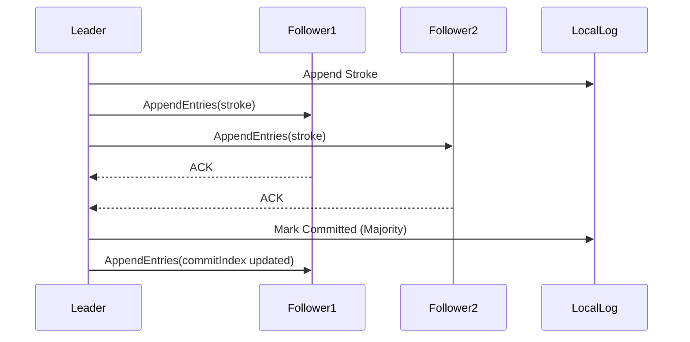

# Teammate 2 - Log Replication + Undo/Redo (Data Plane)

## Responsibilities
*   **AppendEntries RPC**: Validating log replication entries based on pre-log index consistency.
*   **Append-Only Log**: Maintaining ordering guarantees and an immutable sequence of drawing events.
*   **Commit Logic**: Asserting majority quorum confirmation before marking an entry as completely committed.
*   **Idempotency & Data Integrity**: Enabling vector-based undo/redo using log compensation strategies.

## Relevant RAFT Theory
Teammate 2 implements the **Data Plane**, responsible for log replication. Log replication is central to event sourcing across distributed replicas. The model ensures strong consistency and sequential ordering; unless an entry is backed by a majority of distributed nodes, it avoids state transitions. Compensation-based undo/redo guarantees idempotency without corrupting historical logs.

## Architecture Diagram

## Folders & Files
*   `replica/log/`
    *   `appendEntries.py`
    *   `commitManager.py`
    *   `logStore.py`
    *   `models.py`
    *   `undoManager.py`
*   `tests/`
    *   `test_replication.py`

## Specific Code References
*   **AppendEntries Route Handler**: `replica/log/appendEntries.py` (Line 6) `handle_append_entries()`
*   **Server Appends Handler**: `replica/consensus/server.py` (Line 83) `append_entries()`
*   **Append-Only Log Engine**: `replica/log/logStore.py` (Line 17) `class LogStore`
*   **Commit Evaluation Logic**: `replica/log/commitManager.py` (Line 5) `class CommitManager`
*   **Undo/Redo System**: `replica/log/undoManager.py` (Line 6) `class UndoManager`

## Contribution to RAFT
This module maintains the distributed system's state machine. Once consensus is agreed upon by Teammate 1, Teammate 2's components physically manifest these decisions safely. The `logStore` strictly enforces RAFT's append-only nature, preventing desynchronization, while `commitManager` waits for majority confirmation before persisting visual updates to clients.
