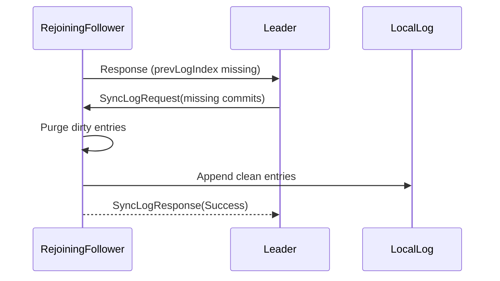

# Teammate 3 - Recovery, Replication Safety + Resilience Layer

## Responsibilities
*   **Restart Recovery**: Rebuilding follower cache from disk and syncing the log memory structure upon unexpected shutdowns.
*   **Catch-up Protocol**: Facilitating fast log reconciliation through the `/sync-log` route when a node replaces an older replica.
*   **Replication Safety**: Ensuring safe PrevLogIndex and PrevLogTerm validations to prevent dirty reads.
*   **Chaos Engineering**: Developing test strategies targeting network failures, dropouts, and multi-failure environments.

## Relevant RAFT Theory
Teammate 3's focus tackles strict consistency under failure—a core reason RAFT is used over basic failover systems. Their domain manages log reconciliation, ensuring that an outdated lagging node drops uncommitted changes and retrieves an undisputed subset of data from the latest term leader.

## Architecture Diagram

## Folders & Files
*   `replica/recovery/`
    *   `consistency_checker.py`
    *   `reconciliation_engine.py`
    *   `replication_safety.py`
    *   `restart_recovery.py`
*   `replica/rpc/`
    *   `network_middleware.py`
*   `tests/chaos/`
    *   `test_kill_leader.py`
    *   `test_multi_failure.py`
    *   `test_restart_replica.py`
*   `tests/`
    *   `test_failover.py`

## Specific Code References
*   **Restart Recovery Engine**: `replica/recovery/restart_recovery.py` (Line 16) `class RecoveryLayer`
*   **Log Reconciliation Mechanics**: `replica/recovery/reconciliation_engine.py` (Line 7) `class ReconciliationEngine`
*   **Consistency Validation Checks**: `replica/recovery/consistency_checker.py` (Line 13) `class ConsistencyChecker`
*   **Replication Safety / Boundary Limits**: `replica/recovery/replication_safety.py` (Line 6) `class ReplicationSafety`
*   **Server Sync Log API**: `replica/consensus/server.py` (Line 168) `sync_log()`

## Contribution to RAFT
Without Teammate 3's layer, a disconnected node returning to the cluster would corrupt the shared consensus. By rigorously implementing `SyncLogRequest`, `ConsistencyChecker`, and `ReconciliationEngine`, the system behaves as a self-healing datastore where disconnected nodes reliably catch up to the committed threshold without impacting zero-downtime promises.
