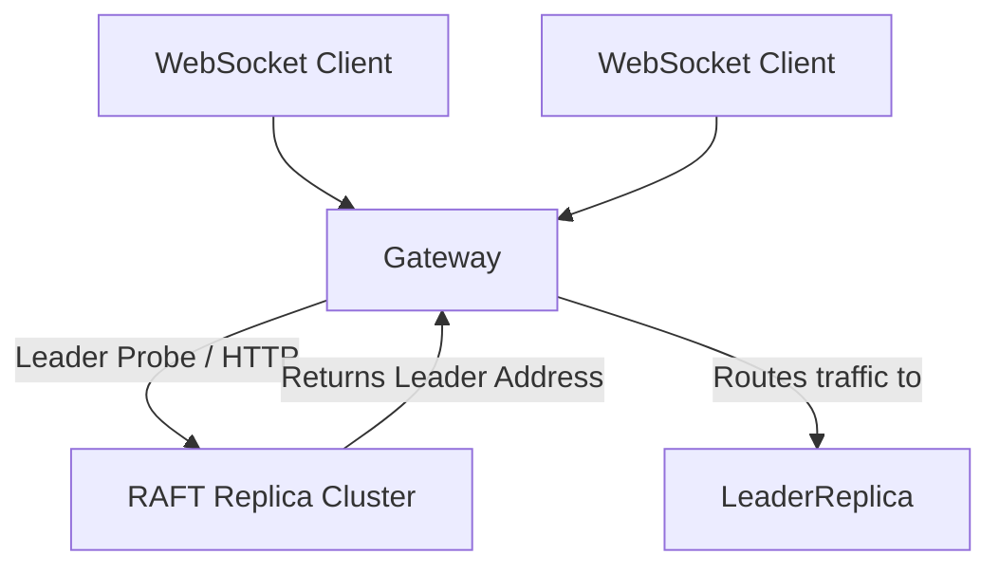

# Teammate 4 - Infrastructure + Gateway + Cloud Deployment

## Responsibilities
*   **WebSocket Gateway**: Serving as the bridge between WebSocket frontend connections and internal HTTP-based RAFT nodes.
*   **Leader Routing & Failover**: Intelligently redirecting inbound requests (e.g., drawing strokes) exactly to the elected node, and re-polling dynamically upon failures.
*   **Containerization**: Setting up `Dockerfile` instances and integrating the overarching cluster via `docker-compose.yml`.
*   **Zero-Downtime Pipeline**: Orchestrating bind mounts for automated node reload gracefully to maintain cluster health during deployments.

## Relevant Theory
Teammate 4 maps the RAFT system to actual cloud execution. They ensure microservice decoupling by hiding the cluster complexities within a smart Gateway proxy. This implements the design pattern of service discovery and client routing, abstracting load balancing and zero-downtime constraints away from the edge clients.

## Architecture Diagram

## Folders & Files
*   `gateway/`
    *   `index.js`
    *   `Dockerfile`
*   `replica1/`, `replica2/`, `replica3/`, `replica4/`
*   `infra/`
*   `docker-compose.yml`

## Specific Code References
*   **WebSocket Gateway Implementation**: `gateway/index.js` (Line 29) `const wss = new WebSocketServer(...)`
*   **Leader Discovery Polling**: `gateway/index.js` (Line 81) `async function discoverLeader()`
*   **Message Redirection Handling**: `gateway/index.js` (Line 143) `async function forwardToLeader(data)`
*   **API Polling Monitor**: `gateway/index.js` (Line 200) `app.get('/cluster-status', ...)`
*   **Container Config**: `docker-compose.yml` (Entire file handling network namespace binding and replica environments)

## Contribution to RAFT
RAFT relies on external clients not needing to know who the leader is. Teammate 4 solves this by polling node states gracefully, re-routing traffic transparently during leader crash/failovers (`/failover`), and keeping client websockets completely insulated from the volatile network conditions of backend node death.
