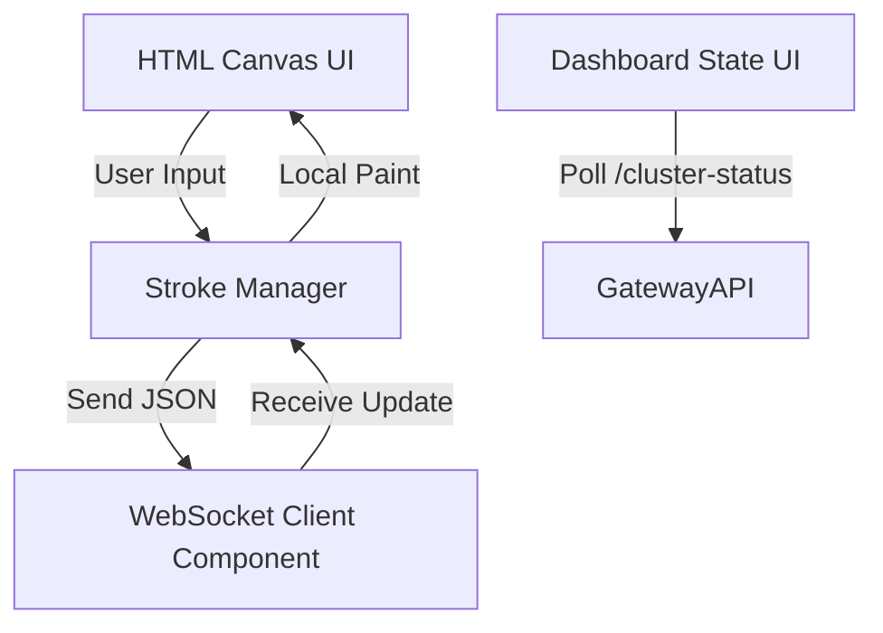

# Teammate 5 - Frontend + Dashboard + Demo Layer

## Responsibilities
*   **Canvas Rendering**: Maintaining a native HTML5 Canvas instance capable of smooth local and remote multi-stroke drawings.
*   **WebSocket Client Component**: Forwarding local coordinates out via the WS channel and reacting synchronously to committed broadcast events.
*   **Monitoring UI**: Creating a `Dashboard` interface that fetches and beautifully visualizes exact consensus states (leader ID, term sizes, replication count).
*   **Demo Utilities**: Assuring smooth failover logic without visual flickering during connection retries.

## Relevant Theory
Teammate 5 handles UI State Synchronization. In distributed systems, user interface persistence relies on distinguishing between "optimistic local states" and "committed remote states". Their architecture builds a resilient client that listens dynamically to the Gateway, reacting faithfully to network reorganizations and broadcasting compensation vectors.

## Architecture Diagram

## Folders & Files
*   `frontend/`
    *   `canvas/canvas.js`
    *   `websocket/ws.js`
    *   `dashboard/dashboard.js`
    *   `controls/controls.js`
    *   `app.js`

## Specific Code References
*   **Canvas Context Configuration**: `frontend/canvas/canvas.js`
*   **Websocket Manager API Integration**: `frontend/websocket/ws.js`
*   **Dashboard Visual Rendering Loop**: `frontend/dashboard/dashboard.js`
*   **Application Bootstrapper Logic**: `frontend/app.js`
*   **Styling Configuration Engine**: `frontend/controls/controls.js`

## Contribution to RAFT
Teammate 5 visually grounds the underlying control and data planes. By correctly serializing and pinging stroke data through the socket, the cluster triggers node elections. When the Gateway emits `leader_change` events, the frontend code cleanly adjusts dashboard UI metrics, granting real-time observability of complex RAFT occurrences without disconnecting the canvas session.
